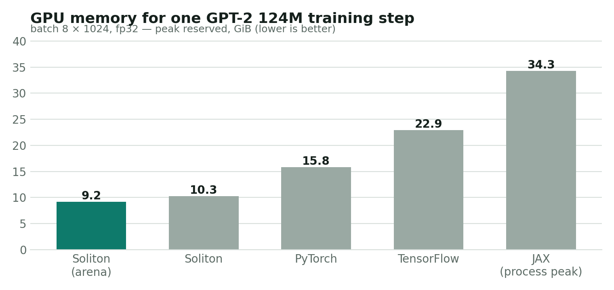
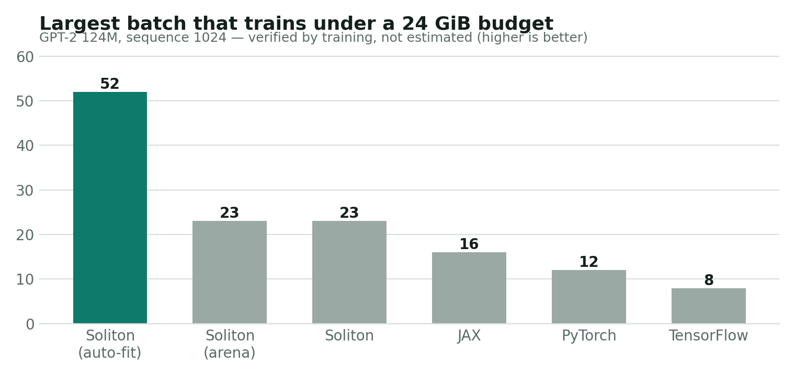
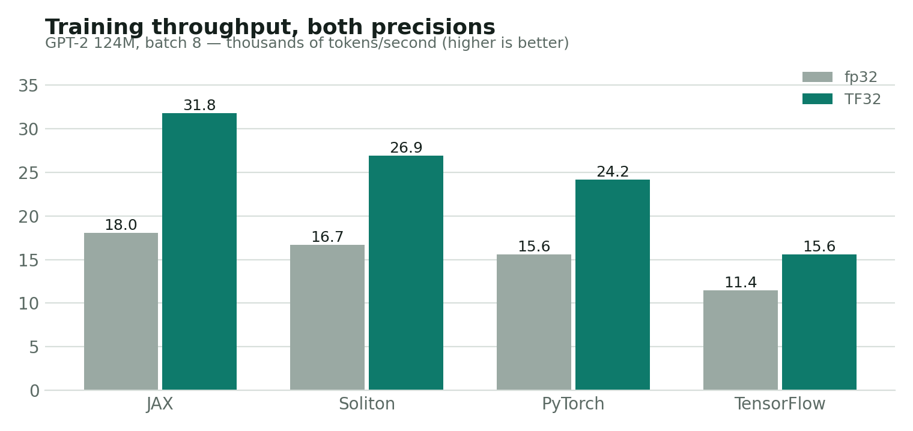

<p align="center">
  
</p>

<p align="center">
  <strong>Experimental.</strong> Soliton is a research-stage framework with a Python API, a D/LDC core, CUDA kernels, and a deterministic memory allocator.
</p>

<p align="center">
  <a href="https://vishesh9131.github.io/soliton/">Documentation</a> ·
  <a href="https://vishesh9131.github.io/soliton/benchmarks.html">Benchmarks</a> ·
  <a href="https://vishesh9131.github.io/soliton/get-started/quickstart.html">Quickstart</a>
</p>

## Evidence first

The main claim is deliberately narrow and testable: given the same training step and allocator policy, a Soliton dry run on its `meta` device predicts the real peak reserved GPU memory exactly—without launching GPU kernels.

Everything below is measured on GPT-2 124M, sequence length 1024, AdamW, one NVIDIA RTX A6000. Soliton, PyTorch, JAX, TensorFlow and tinygrad were held to the same matmul precision in each regime. Raw tables: [`bench/results/fp32/REPORT.md`](bench/results/fp32/REPORT.md) and [`bench/results/tf32/REPORT.md`](bench/results/tf32/REPORT.md).

### Memory for one training step



Soliton reserves less than half of what JAX's process needs and 42% less than PyTorch, because the allocation
trace is known in advance and can be packed into one arena with no fragmentation.

| Framework | Peak reserved, batch 8 | Can it predict this before running? | Cost of predicting |
| --- | --- | --- | --- |
| **Soliton (arena)** | **9.20 GiB** | **Yes — 0 bytes of error** | 0.4 s, no GPU |
| Soliton (caching pool) | 10.27 GiB | Yes — 0 bytes of error | 0.01 s, no GPU |
| PyTorch | 15.83 GiB | Estimate, 5.0–8.6% too low | 5.4 s, needs a GPU |
| TensorFlow | 22.92 GiB | No API | — |
| JAX | 34.28 GiB (process peak) | No API | — |

The prediction is exact at batches 1, 2, 4, 8 and 16, in both precision regimes, for both allocators. Packing
the arena wastes **0.00%** against the max-live lower bound, and costs nothing in speed (0.998×).

### The question people actually ask: what batch fits?



| Framework | Largest batch under 24 GiB | How that answer was reached |
| --- | --- | --- |
| **Soliton, auto-fit** | **52** | solver picks 13 units to recompute, 6 s, no GPU, then verified by training |
| **Soliton** | **23** | predicted in 2 s with no GPU, correct first time |
| JAX | 16 | no way to ask: 6 real training runs, 3 of them crashes, 187 s |
| PyTorch | 12 | its own estimator said 13, which runs out of memory; 7 real runs to find 12 |
| TensorFlow | 8 | no way to ask: 7 real runs, 4 crashes, 183 s |

### Throughput



Soliton is faster than PyTorch and slower than JAX at this workload. Two places it wins outright:

| Workload | Soliton | PyTorch | JAX | TensorFlow | tinygrad |
| --- | --- | --- | --- | --- | --- |
| Elementwise chain, 16M floats | **0.31 ms** | 1.05 | 0.35 | 18.3 | 6.40 |
| 20 steps at changing sequence length | **915 ms** | 867 | 76,514 | — | — |

The chain is the fusion compiler: five kernels become one generated kernel at 666 GB/s, near this card's
bandwidth ceiling. The second row is what compilation costs elsewhere — JAX recompiles for every new shape,
while Soliton's generated kernels take the size as an argument and are never recompiled.

### What the memory plan makes possible

| Capability | Measured result |
| --- | --- |
| Static arena allocation | 0.00% packing waste; −10.5% memory at batch 8, −21.7% at batch 1 |
| Solved recomputation | fits 24 GiB at batch 32 with 11 recomputed units against 14 for whole-block checkpointing, 1.026× faster |
| Reproducibility | bit-identical weights across processes **and across two GPUs**; each precision and fusion setting self-consistent |
| Pre-flight check | whole step validated in 11 ms with no GPU, naming the module a shape error came from |

Those results do **not** claim that Soliton is universally faster or more mature than existing frameworks. On
this machine and workload JAX remains faster where it fits, PyTorch's FlashAttention is roughly 2× faster than
Soliton's attention, and `torch.compile` could not run here at all (Inductor raises "duplicate template name"
on torch 2.10 with Triton 3.6). The reproducible evidence is the memory guarantee and the workflows it enables.

### What makes the plan exact?

Soliton uses the same deterministic allocator and allocation sequence in a real run and on `meta`:

1. Operations and kernels request scratch memory from the allocator in a fixed order.
2. `meta` replays that allocation trace using fake addresses and skips GPU execution.
3. A hard memory limit uses the same pool policy in both modes.
4. The planner can search checkpoint counts before touching a GPU.
5. `sl.arena` goes one step further: the recorded trace is packed into a single arena, giving every tensor a
   fixed offset, and the run replays those offsets with a per-allocation size check. Tensors whose lifetimes do
   not overlap share the same bytes, so the plan *is* the allocation.

The direct regression coverage is in [`tests/test_memory.py`](tests/test_memory.py) and
[`tests/test_arena.py`](tests/test_arena.py).

## Install

Soliton currently builds from source on Linux with an NVIDIA CUDA toolkit. It is not yet published as a PyPI package.

### Requirements

- Python 3.10+
- NumPy and pytest
- NVIDIA CUDA toolkit with `nvcc`, cuBLAS, and NVRTC
- NCCL (the current shared library links it for data parallelism)
- [LDC](https://ldc-developers.github.io/) — the LLVM D compiler

One Conda-based setup is:

```bash
git clone https://github.com/vishesh9131/soliton.git
cd soliton

conda create -n soliton python=3.12 numpy pytest
conda activate soliton
conda install -c conda-forge ldc
conda install -c nvidia cuda-toolkit nccl

export CUDA_HOME="$CONDA_PREFIX"
export NCCL_HOME="$CONDA_PREFIX"
make CUDA_ARCH=sm_86  # RTX A6000; change for your GPU
```

The build writes `python/soliton/libsoliton.so`. For another NVIDIA architecture, set `CUDA_ARCH` to its CUDA compute capability (for example, `sm_90`).

## Use it

### Plan before running

This creates GPT-2 124M on the `meta` device, computes its allocation trace, and reports the memory budget without running CUDA kernels.

```bash
PYTHONPATH=python python examples/gpt2.py --plan-only --batch 8
```

Example output:

```text
[plan] GPT-2 124M: 124.4M params, batch 8x1024, accum 1
[plan] peak allocated 9.226 GiB, peak reserved 10.268 GiB (dry run took 0.01s, no GPU used)
```

### Train under a hard memory budget

Prepare the TinyStories data, then let Soliton solve which attention and MLP halves to recompute so the step fits the stated cap.

```bash
PYTHONPATH=python python examples/prepare_tinystories.py
CUDA_VISIBLE_DEVICES=0 PYTHONPATH=python python examples/gpt2.py \
  --data data/tinystories \
  --batch 8 \
  --budget-gib 24
```

### Use the Python API

```python
import soliton as sl

def train_step(device):
    x = sl.normal((4096, 4096), device)
    return sl.sum_(sl.gelu(x))

# Inspect the allocation plan without using a GPU.
plan = sl.plan(train_step, budget=24 * 2**30)

# Opt in to TensorFloat-32 matmuls on supported NVIDIA GPUs.
sl.set_tf32(True)
```

### Test the build

```bash
PYTHONPATH=python python -m pytest
```

For multi-GPU data-parallel GPT-2 training, expose the GPUs you intend to use and pass `--nproc`:

```bash
CUDA_VISIBLE_DEVICES=0,1 PYTHONPATH=python python examples/gpt2.py \
  --data data/tinystories --nproc 2
```

## Current scope

Implemented today:

- Float32 tensors, reverse-mode autograd, common neural-network modules, AdamW, CPU and CUDA backends
- Deterministic caching allocator, `meta` planning, a hard memory cap, and checkpoint auto-fit
- Static arena planning (`sl.arena`): one allocation for the whole run, offsets solved offline from the trace
- Solved recomputation (`sl.recompute`), a pre-flight checker (`sl.preflight`), and reproducible runs
- GPT-2 124M training with fused causal attention and data parallelism over NCCL
- Opt-in TF32 and an elementwise CUDA fusion path

Not yet implemented: BF16/FP16 mixed precision, true strided views, offload/tensor/pipeline parallelism, and a mature whole-program compiler. See the raw benchmark reports before relying on performance conclusions outside the measured workload.

## Reproduce the benchmark

```bash
PYTHONPATH=python python bench/run.py --help
PYTHONPATH=python python bench/micro.py --help
```

The benchmark compares equivalent GPT-2 workloads in Soliton, PyTorch, JAX, and TensorFlow. Run a precision regime consistently—do not compare JAX's TF32-default configuration to strict FP32 results from other frameworks.

## Project status

Soliton is an early open-source experiment. Contributions, benchmark replications, and bug reports are welcome; claims should remain tied to reproducible measurements and their stated hardware, precision, and workload.
